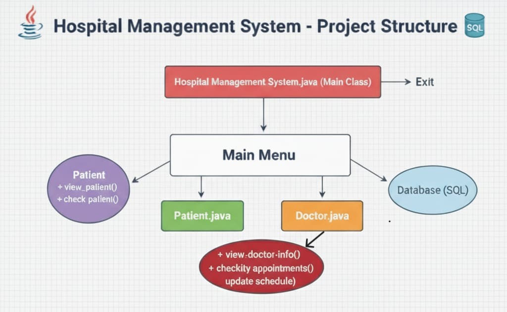

# 🏥 Hospital Management System

A **menu-driven Hospital Management System** built using **Java**, **JDBC**, and **MySQL** for managing patients, doctors, and appointments.

---

## 📌 Features

- ✅ Add / View / Delete Patients  
- ✅ Add / View / Delete Doctors  
- ✅ Schedule and view appointments  
- ✅ Interactive menu-driven system  
- ✅ MySQL database integration  

---

## 🏗 System Architecture

**Entry Point:** `HospitalManagementSystem.java`  
**Main Menu:** Central hub for module selection  
**Modules:**
- **Patient Module** → `Patient.java`  
- **Doctor Module** → `Doctor.java`  

**Data Interaction:** Modules interact with **MySQL** database to store/retrieve information.  
**Exit:** Application terminates from the Main Class.

### 🖼 Architecture Diagram

---

## 🧩 Module Responsibilities

| Module  | Core File       | Key Methods           | Purpose |
|---------|----------------|--------------------|---------|
| Patient | `Patient.java`  | `view_patient()`     | Display patient details |
|         |                | `check_patient()`    | Validate patient status |
| Doctor  | `Doctor.java`   | `view_doctor_info()` | View doctor profile |
|         |                | `check_appointments()` | View schedule & appointments |
|         |                | `update_schedule()`  | Modify availability |

---

## 💾 Database Schema

### 🧍 Patients Table
| Column Name | Data Type | Constraint | Description |
|-------------|------------|-------------|--------------|
| P_ID        | INT        | PK          | Unique identifier |
| Name        | VARCHAR    | -           | Patient's full name |
| Age         | INT        | -           | Patient's age |
| Gender      | VARCHAR    | -           | Patient's gender |

### 👨‍⚕️ Doctors Table
| Column Name | Data Type | Constraint | Description |
|-------------|------------|-------------|--------------|
| D_ID        | INT        | PK          | Unique identifier |
| Name        | VARCHAR    | -           | Doctor's full name |
| Speciality  | VARCHAR    | -           | Doctor's medical specialization |

### 📅 Appointments Table
| Column Name | Data Type | Constraint | Description |
|-------------|------------|-------------|--------------|
| A_ID        | INT        | PK          | Appointment record ID |
| P_ID        | INT        | FK          | Links to Patients |
| D_ID        | INT        | FK          | Links to Doctors |
| App_Date    | DATE       | -           | Scheduled date |

---

